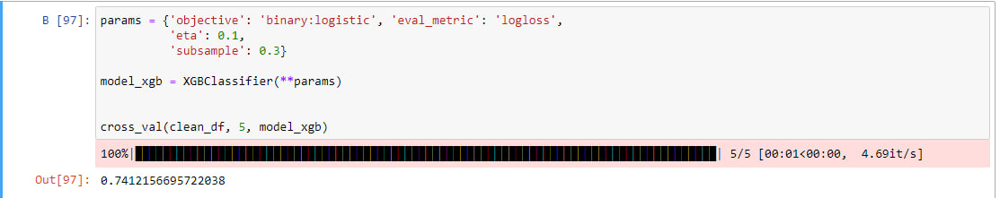
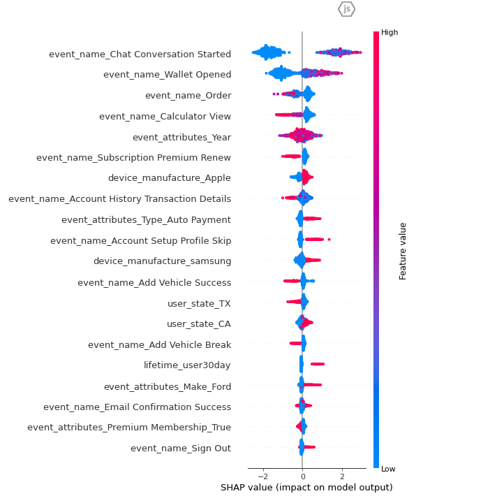

#  4NN team 🧨

Привіт!
Ми команда 4NN і ми готові презентувати наше рішення :)
Повний програмний код знаходиться за шляхом main.ipynb

## Preprocess

Дуже коротко і стисло розкажем про наш пропроцесинг даних:
- З початкового датасету ми берем усі колонки окрім device_model.
- Підставляєм відповідно outofband з event_platform/device_manufacture на відповідні йому дані, підтянуті з userid.
- Видаляєм подію Chat Conversation Opened, оскільки ця інфа дублюється в Chat Conversation Started.
- Обрізаєм всі події для кожного користувача "Subscription Premium Cancel", адже нам не важливо що було далі, важливо чому користувач відмінив підписку. Додатково я перевірив що після події 'Subscription Premium Cancel' більше не було події "Subscription Premium" тому сміливо видаляємо:) Дані після цільової дії лише засмічують датасет.
- Далі групуємо датасет по користувачам і схлопуєм усі параметри в списки.
- Додаємо новую фічу - чи відмінив користувач підписку зразу після 30 днів з моменту покупки. Є гіпотеза, що користувач в основному використовує додаток на 1 раз.
- Розписуємо one-hot-encoding методом усі поля в event_name та event_attributes. 
- Видаляємо усі колонки, які для нас не вигдяють такими що мають вплив.
- Фільтруємо датасет, берем лише 'event_name_Subscription Premium' >=1. Це необхідно для того, щоб отримати тільки тих користувачів, які колись купили підписку, а отже і могли зробити відписку. Нам не потрібно аналізувати користувачів що не роблять підписки, наша задача зрозуміти чому підписка відміняється.
- Використовуємо нормалізацію даних.
- Переходимо до побудови моделі.

## Model

- В якості моделі ми використовуємо XGBClassifier: {'objective': 'binary:logistic', 'eval_metric': 'logloss', 'eta': 0.1, 'subsample': 0.3}
- В якості метрики F1-score.
- Використовуємо cross-val.

При навчанні моделі ми отримали метрику F1-score, що дорівнює 0.741 :

## Results

Тепер використовуємо SHAP для того щоб отримати feature importance разом зі знаком змінних, що розуміти в яку сторону вони мають вплив:
(звісно і сюди берем cross-val, адже feature-importance змінюється від моделі до моделі)

SHAP показує вплив (знак) на результат моделі та feature importance кожного фактору і сортує їх від найвпливовішого до найменьшого: 
- Найбільш впливовий фактор event_name_Chat Conversation Started, цей параметр приймає значення 0/1, 1 відповідає за подію Chat Conversation Started, звернення впливає на відміну підписок, адже користувач зіткнувся з проблемою і ймовірно йому в чаті з нею не допомогли.
- Наступний за важливості параметр event_name_Wallet Opened - користувач перевіряє рахунок, можливо щось не так з оплатою, тому ця подія і корелює з відтоками підписки. 
- Наступний параметр event_name_Order, цей параметр навпаки утримає покупців, що логічно.
- Наступний параметр event_name_Calculator View - параметр утримує клієнтів, адже він дозволяє прорахувати витрати на майбутнє і бути до них готовим.
- event_attributes_Year - рік машини користувача.
- event_name_Subscription Premium Renew - користувач поновлює підписку, що звісно вказує на те, що сервіс йому подобається і він буде продовжувати ним користуватись.
- device_manufacture_Apple - багато користувачів з девайсом Apple відмовляються від підписки, можливо додаток погано співпрацює під ios.
- event_name_Account History Transaction Details - користувач переглядає історію покупок, така можливість впливає позитивно на утримання користувача.
- event_attributes_Type_Auto Payment - підключення auto payment негативно впливає на утримання користувача на платформі.
- event_name_Account Setup Profile Skip - користувачі, що пропускають заповнення профілю, більш ймовірно відмовляться від підписки.
- device_manufacture_samsung - користувачі стикаються з проблемами на девайсі samsung, такі користувачі більш ймовірно відмовляються від підписки.
- event_name_Add Vehicle Success - додавання користувачем свого транспорту позитивно впливає на його утримування на платформі.
- user_state_TX - користувачі зі штату TX більш ймовірно залишаються з додатком.
- user_state_CA - користувачі зі штату CA більш ймовірно відмовляються від підписки.
- event_name_Add Vehicle Break - подія Add Vehicle Break утримує користувача на платформі (ймовірно він таки переходить до події Add Vehicle Success).
- lifetime_user30day - наша власна фіча, яка показує що багато користувачів вімовляються від підписки через місяць, тобто їм сервіс був необхідний тільки на цей проміжок часу.
- event_attributes_Make_Ford - користувачі, які вибирають машину марки Ford, більше схильні відмовлятись від підписки, можливо додаток погано співпрацює з цією маркою.
- event_name_Email Confirmation Success - подія підтвердження електронної пошти впливає на поведінку користувача.
- event_attributes_Premium Membership_True - подія впливає позитивно на отримування користувача на платформі.
- event_name_Sign Out - коли користувач розлогінюється - це збільшує ймовірність того що він відмовиться від підписки.

## Next Steps

- Подумати як можна враховувати послідовності через seq2seq моделі подій.
